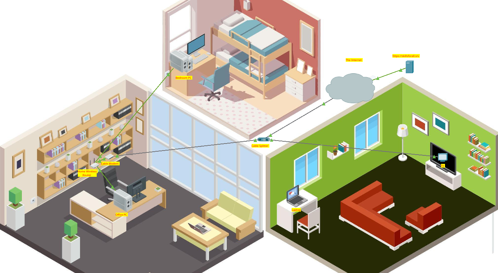

# Home Wireless Router & Client Configuration 

## Overview
This laboratory focuses on the deployment, configuration, and secure setup of a home wireless network. It simulates a residential environment spanning multiple rooms (Office, Bedroom, and Living Room) connected through a Cable Modem and a Coaxial Splitter to an external ISP cloud.

The objective was to establish correct physical cabling, configure the Home Wireless Router (DHCP pools, SSID, and WPA2 security metrics), and ensure automatic network parameter assignment for both wired and wireless clients.

**Achievement:** Successfully completed with a score of **19/19 (100%)** via Cisco Networking Academy.

---

## Network Topology (Physical View)
Below is the spatial and structural layout of the residential network:

---

## Configuration Details & Technical Specs

### 1. Home Wireless Router Setup
* **Internet Interface:** Connected via a Straight-Through copper cable to the Cable Modem (Internet Port).
* **DHCP Server:** Enabled to automate IP allocation across residential end-devices.
  * **Pool Configuration:** Secured with a customized maximum user limit and administrative password access control.
* **Wireless 2.4G Settings:**
  * **SSID:** Broadcasted for home connectivity.
  * **Security Mode:** WPA2-Personal (AES Encryption Type) enabled with a strong pre-shared passphrase.

### 2. Client Devices Integration
* **Office PC & Bedroom PC:** Connected via FastEthernet interfaces using Copper Straight-Through cabling to the router's LAN ports. Network interfaces are configured as **DHCP Clients** to fetch automatic leases.
* **Smart Laptop:** Integrated via an internal `Wireless0` interface, linked successfully over-the-air to the correct SSID using WPA2 authentication.

### 3. Coaxial Infrastructure
* **Coaxial Splitter0:** Routes RF signals across the environment.
  * `Coaxial1` -> Linked directly to the **Cable Modem** (Port 0).
  * `Coaxial2` -> Linked directly to the **TV0** (Port 0) in the living room area for residential service.

---

## Verification & Results
* **IP Addressing:** All end-devices successfully requested and received valid IPv4 configurations from the local pool.
* **Connectivity Tests:** End-to-end connectivity verified across the local wireless LAN and out towards the simulated web server infrastructure.
